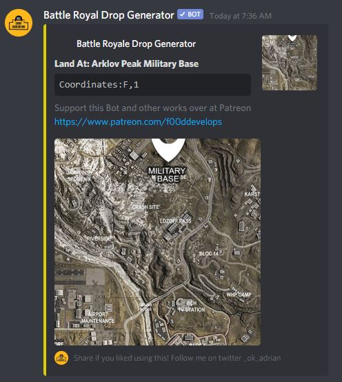

# Battle Royale Drop

The Battle Royale Drop is a discord bot for all your popular Battle Royale Games
Currently Fortnite, Warzone, Blackout PUBG, and Apex Legends are supported
[You can access the full site here with interactive map](https://brdrop.com)
[Invite the bot to your server!](https://discordapp.com/oauth2/authorize?client_id=636141023789056002&scope=bot&permissions=0) 



## Installation

Download [nodejs](https://nodejs.org/en/download/)

Clone repository

```bash
git clone https://github.com/f00d4tehg0dz/Battle-Royal-Drop.git
```
cd into directory and run 

```bash
npm install
```

to start just do 

```bash
node index.js
```

## Usage

```bash
!frdrop for Fortnite

!wzdrop for Warzone

!wzrbdrop for Warzone Rebirth

!aldrop for Apex Legends

!bodrop for Blackout

!pubgmdrop for PUBG Miramar

!pubgedrop for PUBG Erangel

!help for list of commands

!server for server info

!user-info for user information
```

## Contributing
Pull requests are welcome. For major changes, please open an issue first to discuss what you would like to change.

Please make sure to update tests as appropriate.

## License
[MIT](https://choosealicense.com/licenses/mit/)
